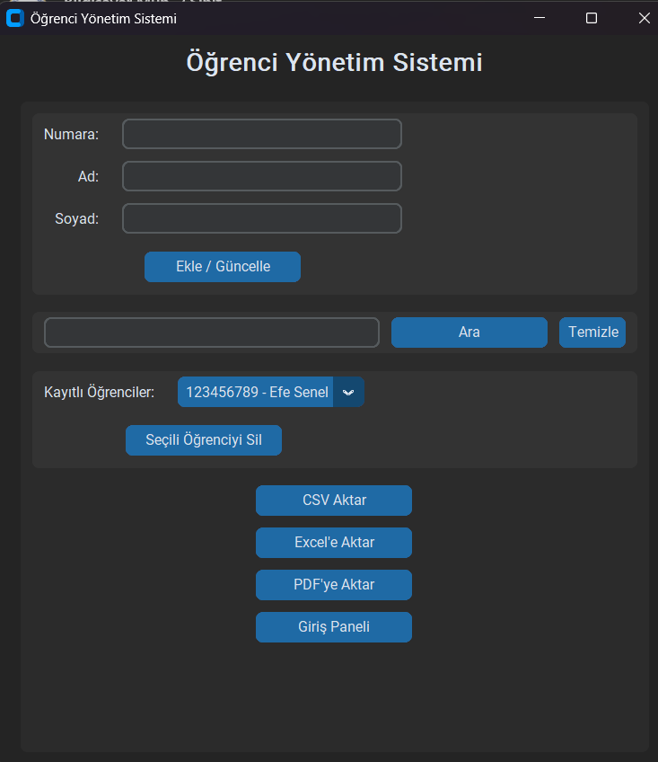

# Öğrenci Yönetim Sistemi

Bu proje, Python ile yapılmış basit bir öğrenci yönetim sistemidir.

## Özellikler
- Öğrenci ekleme, silme, güncelleme
- CSV, Excel, PDF dışa aktarım
- Basit giriş ekranı
- CustomTkinter arayüzü

## Kullanım
```bash
pip install -r requirements.txt
python main.py
```

## Giriş Bilgileri
- Kullanıcı Adı: admin
- Şifre: 1234

## Gereksinimler
- Python 3.8+
- customtkinter
- openpyxl
- fpdf
## Ekran Görüntüsü
